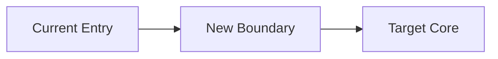

# Redesign Brief

## Step 0 Fit Gate

- Decision: `incremental` or `assumption-first redesign`
- Why:
  - ...

## Proposed Change(s)

- ...

## Foundational Assumptions (Normalized)

| Assumption | Type (must/constraint/optimize) | Testability Signal |
| ---------- | ------------------------------- | ------------------ |
| ...        | ...                             | ...                |

## Invariants / Must-Keep Behavior

- ...

## Non-Goals

- ...

## Target Architecture (Clean-Slate)

- Components:
- Data ownership:
- Contracts:
- Non-functional targets:

## Contract Change Table

| Surface | Current Contract | Target Contract | Compatibility Strategy | Cutover Stage |
| ------- | ---------------- | --------------- | ---------------------- | ------------- |
| ...     | ...              | ...             | ...                    | ...           |

## Key Tradeoffs

- ...

## Architecture Diagram

## Gap Map (Current -> Target)

| Current Component | Target Component | Action (Keep/Replace/Delete/Introduce) | Interface Break | Data Migration Impact |
| ----------------- | ---------------- | -------------------------------------- | --------------- | --------------------- |
| ...               | ...              | ...                                    | ...             | ...                   |

## Consequential Decisions (for ADRs)

- ...

## Open Questions

- ...
